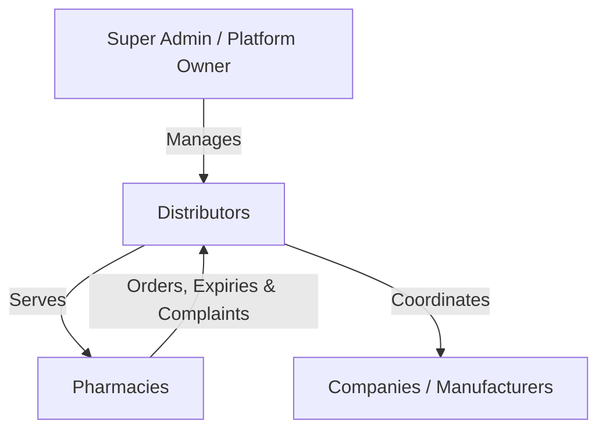

#  The Digital Portal
### **www.thedigitalportal.net**

> **Connecting Healthcare Networks: Seamless Integration for Pharmacies, Distributors, and Manufacturers.**

---

---

## 📖 Company Bio & Vision

**The Digital Portal** is a next-generation technology provider dedicated to standardizing, simplifying, and automating complex logistics, administration, and communication workflows in the medical and healthcare sector. 

Our premier software suite, **TheDigitalPortal**, bridges the communication and operational gap between retail pharmacy networks, pharmaceutical distributors, and manufacturers. 

Beyond pharmacy supply chains, we are expanding our software footprints to develop robust, modern solutions across the entire medical ecosystem—including clinic management systems, laboratory information systems, and patient healthcare platforms.

---

## 🛠️ TheDigitalPortal (Pharmacy Network Suite)

The flagship module of **The Digital Portal** serves as an end-to-end B2B hub enabling seamless digital transactions, inventory synchronization, and communication between pharmacies and distributors.

### 🎭 Multi-Tenant Architecture & Roles

| Role | Core Capabilities |
| :--- | :--- |
| **👑 Super Admin** | Platform oversight, system SMTP config verification, secure database backups, audit logging, distributor subscription and plan management. |
| **🏢 Distributor** | Product master data uploads, batch tracking (CSV imports), SMTP mail servers integration, announcement dispatch, trade offer distribution, complaint resolution, and expiry logistics management. |
| **🏥 Pharmacy** | Multi-product order creation, batch-specific short-expiry reporting, promotional trade offer redemptions, direct complaint logging, and distributor communications. |

---

## 🌟 Core Features

### 📅 Advanced Expiry Management
*   **Pharmacy reporting**: Retail pharmacies report batches nearing expiry directly on their dashboard.
*   **Accumulated reports**: Distributors compile, filter, and export multi-pharmacy reports by company.
*   **Approval flows**: Seamless transit status transitions: *Draft* ➔ *Under Review* ➔ *Accepted/Rejected* ➔ *Sent to Company*.

### 📨 Dynamic Communication Center
*   **SMTP Orchestration**: Unique SMTP settings per distributor to send white-labeled email alerts directly to pharmacies and manufacturing companies.
*   **Notification Engine**: Real-time toast notifications, system warnings, and changelog visibility.

### 📦 Order & Trade Offer Engines
*   **Smart Orders**: Seamless placement of multi-item purchase orders with automatic trade-price (TP) and retail-price (MRP) calculations.
*   **Trade Offers**: Distributors create bonus-scheme, percentage-based, or flat discounts on products to drive sales, visible directly to linked pharmacies.

### 🔒 Enterprise-Grade Security
*   **Firebase security rules**: Locked down database pathways preventing cross-tenant reads or unauthorized updates.
*   **Data Invariants**: Strict transactional logic enforcing correct distributor-pharmacy relationships and protecting private SMTP/PII info.

---

## 🔮 Future Medical Software Horizon

As part of our commitment to digitalizing the healthcare industry, **The Digital Portal** is expanding into the following domains:

*   **🏥 Hospital & Clinic Management Systems (HMS)**: Automated patient scheduling, electronic health records (EHR), and billing software for private clinics and multi-specialty hospitals.
*   **🔬 Laboratory Information Systems (LIS)**: Seamless barcode tracking, analyzer integrations, and secure patient report distribution portals.
*   **📱 Patient Companion Apps**: Telemedicine consultation systems, digital prescription tracking, and direct pharmacy network integration for patients.
---
© 2026 The Digital Portal. All rights reserved.
